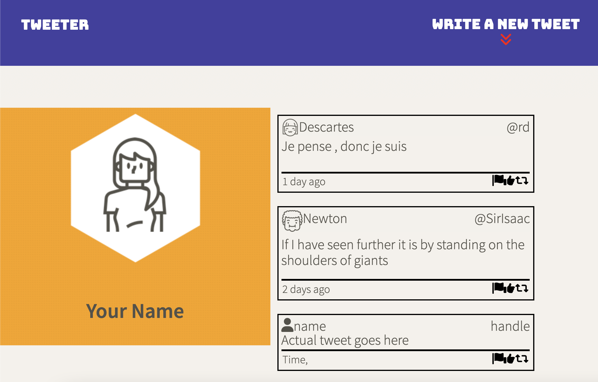
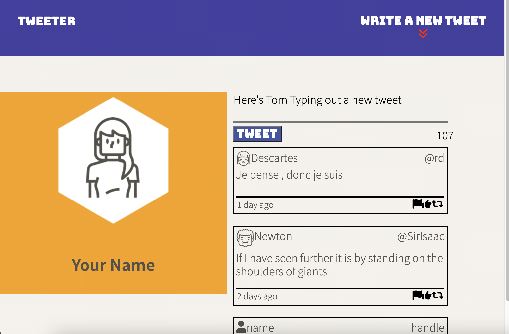
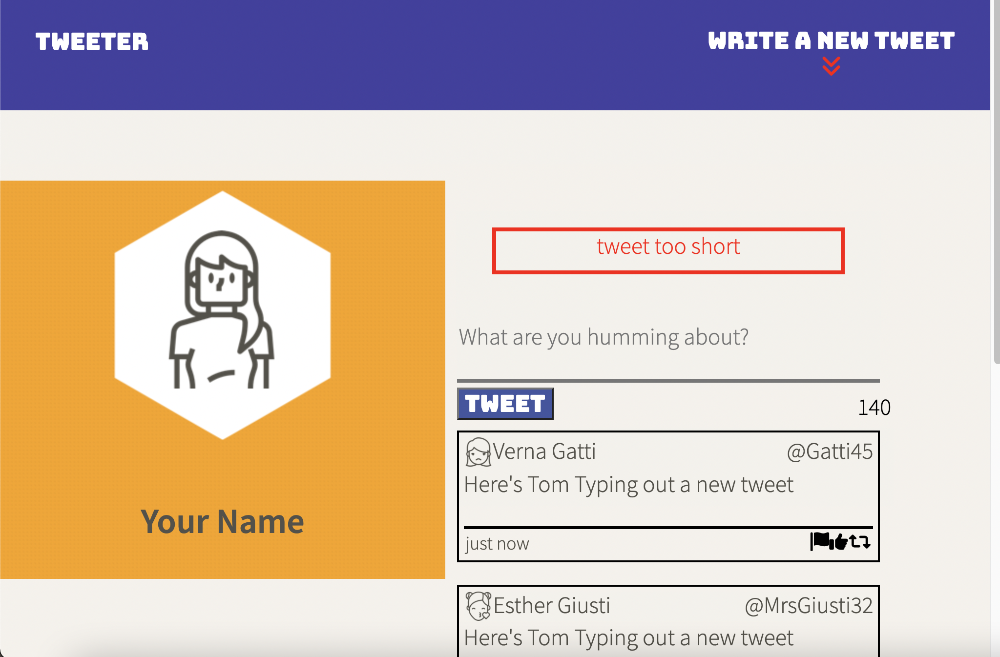
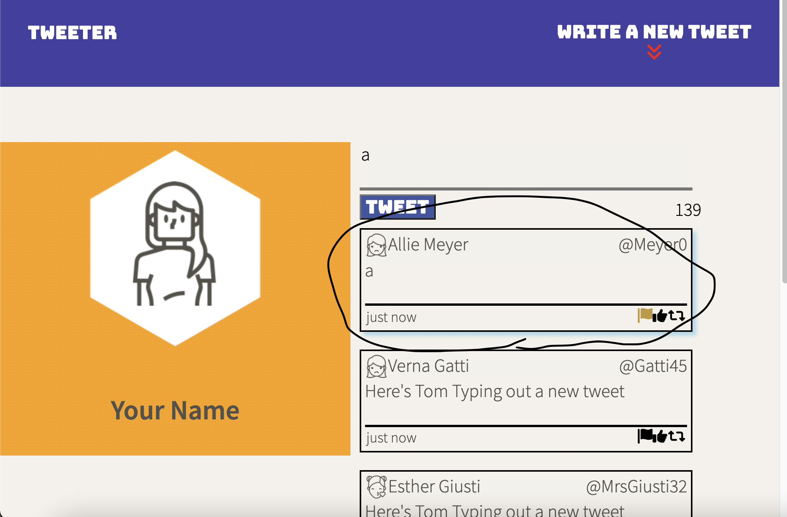
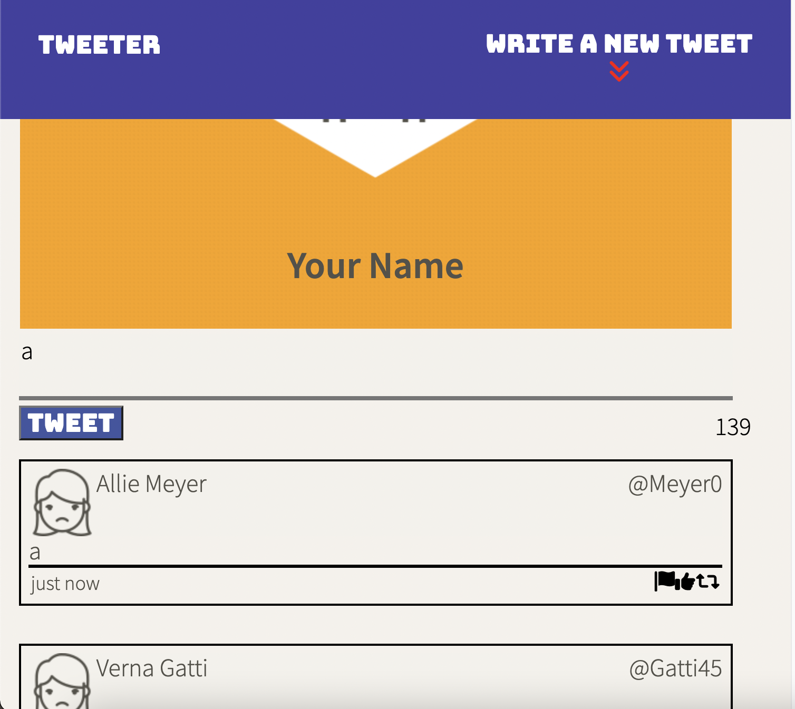

# Xin Sheng (Tom) Zhang's Tweeter Project

Tweeter is a simple, single-page Twitter clone.

This repository is my version of the project: I built upon it to practice my HTML, CSS, JS, jQuery and AJAX front-end skills, and my Node, Express and MongoDB back-end skills.

## Getting Started

1.  Install dependencies using the `npm install` command.
2. Start the web server using the `npm run local` command. The app will be served at <http://localhost:8080/>.
3. Go to <http://localhost:8080/> in your browser.

## Dependencies

- Express
- Node 5.10.x or above
- body-parser
- chance
- md5
- timeago

# Features

The starting page

## Creating a new tweet $ ajax

Here's the create new tweet dialogue

## Some Error messages

Here's some error messages for invalid tweets

## Event listeners

Here's the interactivity on mouseover

## The mobile version

Here's the mobile portait orientation.